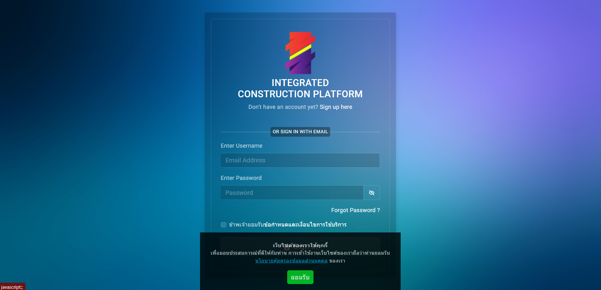

# integreata

# รายละเอียด

integreata Platform บริหารจัดการงานก่อสร้างในรูปแบบ Common Data Environment (CDE) ที่สามารถ upload ข้อมูลไฟล์ได้หลายรูปแบบ เช่น PDF word Excel JPEC รวมทั้งไฟล์ AutoCAD และ ไฟล์ในรูปแบบ 3D เช่น Revit IFC เป็นต้นซึ่ง Platform นี้สามารถสร้างกระบวนการทำงานร่วมกันตามมาตรฐาน ISO19650 และสามารถเปิดไฟล์แผนงาน Microsoft Project ได้และสามารถ tag ความก้าวหน้างานก่อสร้างในรูปแบบ 3D ได้รวมทั้งสามารถถอดปริมาณเพื่อที่จะนำเข้าสู่ระบบจัดซื้อจัดจ้างได้อีกด้วย

